# Elementos de navegación

* **Track:** _Common Core_
* **Curso:** _Creando tu primer sitio web interactivo_
* **Unidad 02:** _Intro a User Experience Design_

***

El presente reto pone a prueba nuestros conocimientos básicos sobre UX y UI.

## Objetivo

El reto consiste en identificar los elementos de navegación en las siguientes páginas web: **breather y medium**.

## 1. Breather

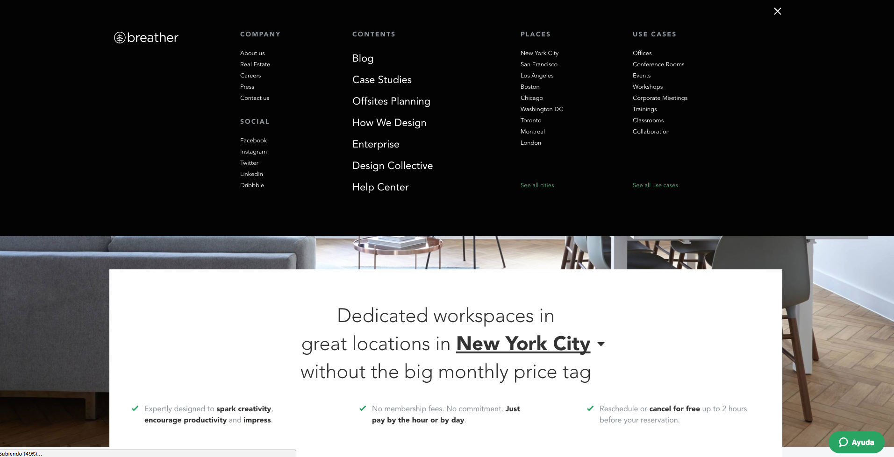

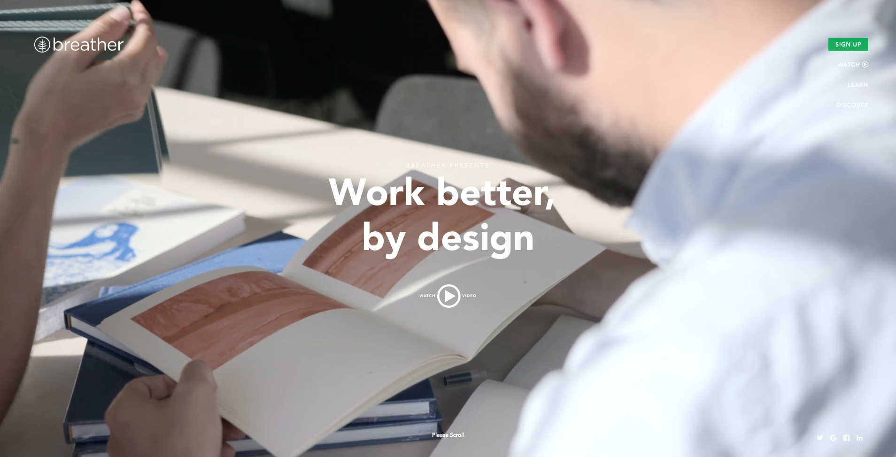  

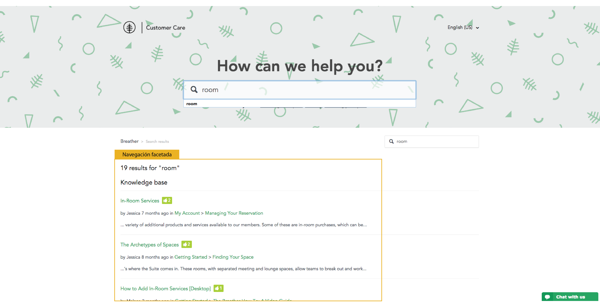  

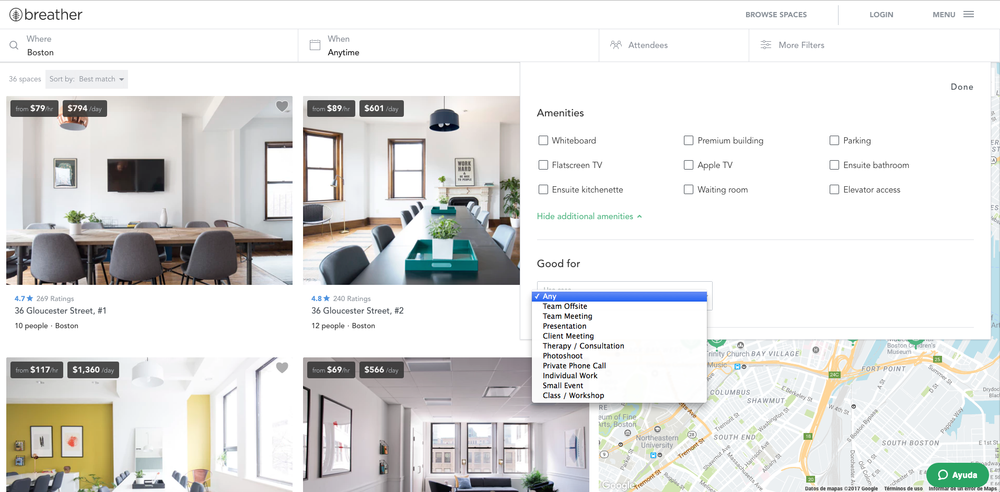  

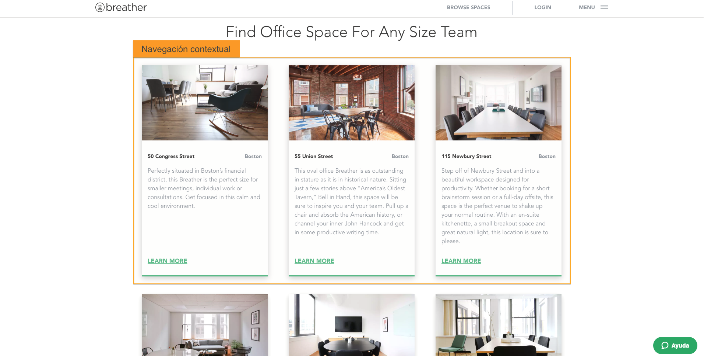  

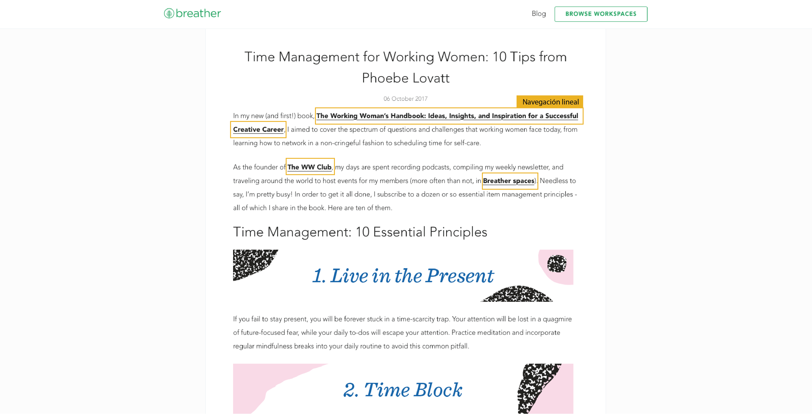   

## 2. Medium  

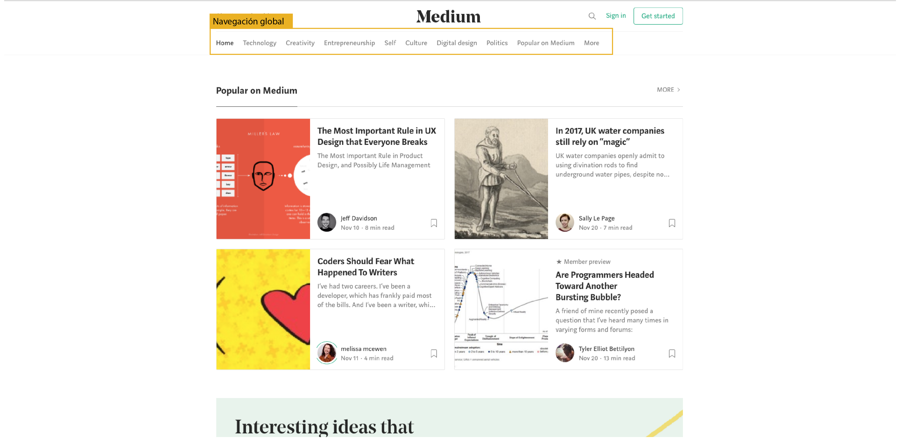  

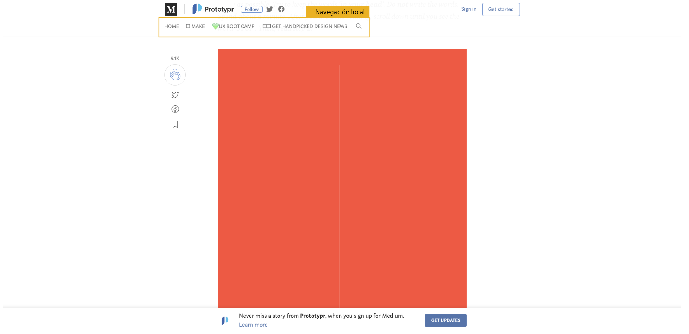  

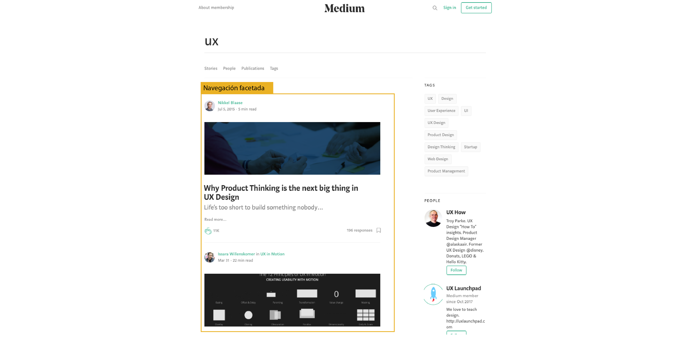  

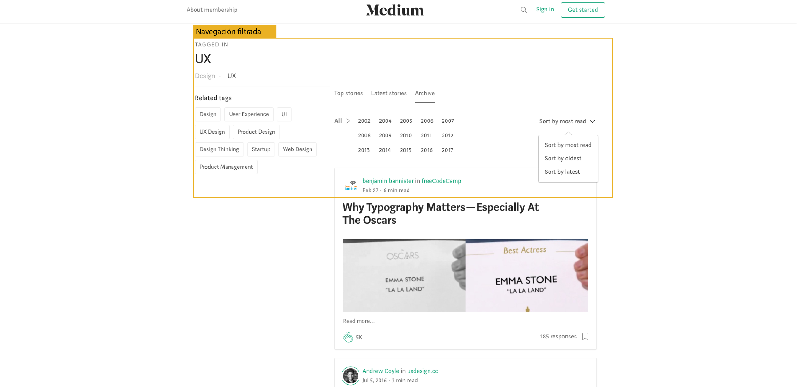  

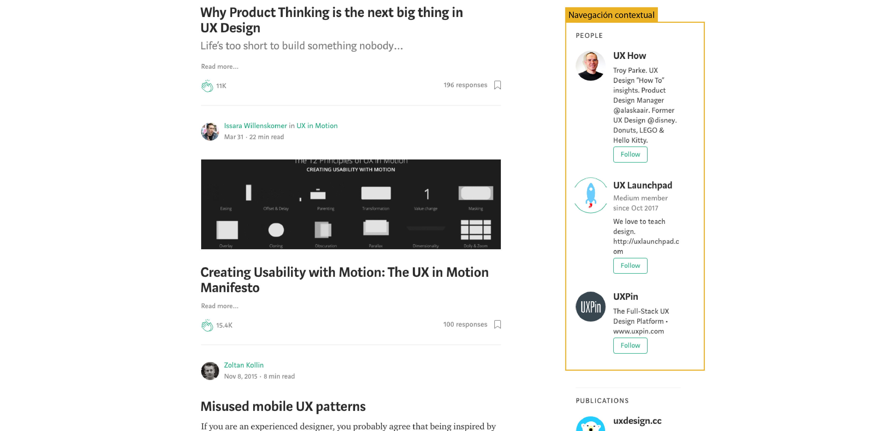  

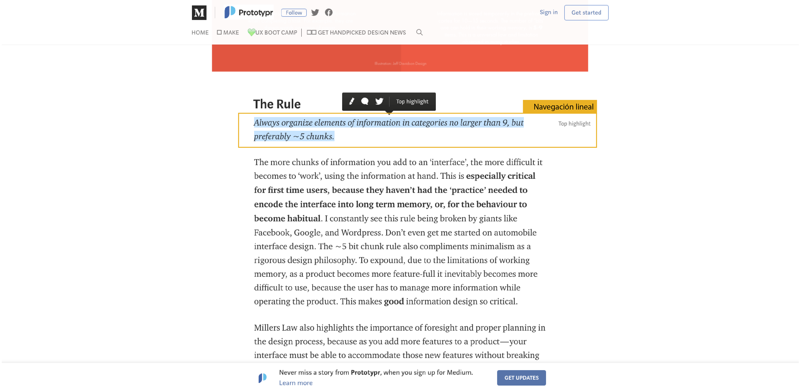  

## Autor

* Gabriela Mamani Flores.
